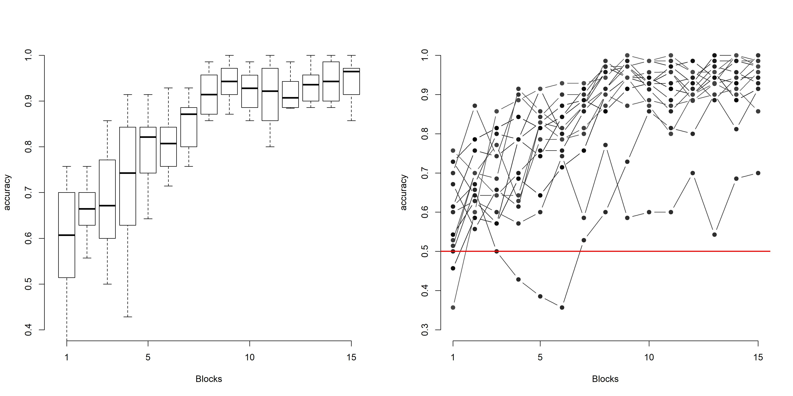

# code_showcase
This is a sample of my codying projects done in R and Python
### Instructed and Uninstructed learning routines of new words
These are two distinct learning routines to learn new words based on visual hebbian learning. A volunteer has to learn 50 new meaningless words visually presented on the screen (e.g. 'catampo'). In the uninstructed routine he has to disentagle the new words from random distractors pressing the button 'yes' everytime he thinks that is encountering a word, and 'no' everytime he thinks that instead what he's looking is a distractor. Everytime the guess is correct, he receives a visual feedback that consists in the correct word coloured in green, otherwise in red. At the beginning the behaviour of the volunteer is almost at chance, however in the following blocks he menages to get right the task, remembering his correct choices. Notably, he reaches a plateau around the 13th block.

Here there are the learning trajectories of 14 volunteers that participated in the learning experiment. In the left graph, means are aggregated by participants and by blocks. In the right graph, means are aggregated only by blocks in order to visually inspect the singular behaviours. Every point is a participant and the chance level is highlighted in red:

